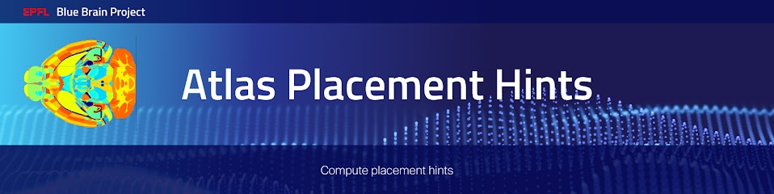

|banner|

Overview
=========

This project contains tools to compute placement hints.
Placement hints are used by the placement algorithm to place 3D cells in the context of circuit building.

After installation, you can display the available command lines with the following ``bash`` command:

.. code-block:: bash

    atlas-placement-hints --help

Installation
============

This python project depends on Ultraliser_ for the algorithms which follow a mesh-based approach.

Once Ultraliser_ is installed, run the following ``bash`` commands:

.. code-block:: bash

    pip install atlas-placement-hints

Examples
========

To generate the placement hints datasets for the isocortex, one can do the following:

Note that the required datasets under `data/*` can be generated by following the example in `atlas-splitter`_.

Also note, depending on the resolution of the volume, this may require significant amounts of available RAM).

.. code-block:: bash

   atlas-placement-hints isocortex                              \
     --hierarchy-path data/ccfv3/split_hierarcy.json            \
     --annotation-path data/ccfv3/split_annotations.nrrd        \
     --direction-vectors-path data/ccfv3/direction_vectors.nrrd \
     --algorithm voxel-based                                    \
     --output-dir data/

Instructions for developers
===========================

Run the following commands before submitting your code for review:

.. code-block:: bash

    cd atlas-placement-hints
    isort -l 100 --profile black atlas_placement_hints tests setup.py
    black -l 100 atlas_placement_hints tests setup.py

These formatting operations will help you pass the linting check `testenv:lint` defined in `tox.ini`.

Citation
========

When you use this software, we kindly ask you to cite the following DOI:

.. image:: https://zenodo.org/badge/451806240.svg
   :target: https://zenodo.org/badge/latestdoi/451806240

Acknowledgements
================

The development of this software was supported by funding to the Blue Brain Project, a research center of the École polytechnique fédérale de Lausanne (EPFL), from the Swiss government’s ETH Board of the Swiss Federal Institutes of Technology.

For license and authors, see LICENSE.txt and AUTHORS.txt respectively.

Copyright © 2022 Blue Brain Project/EPFL

.. _Ultraliser: https://github.com/BlueBrain/Ultraliser
.. _`atlas-splitter`: https://github.com/BlueBrain/atlas-splitter

.. substitutions

